[](https://github.com/thom/azure-ci-cd-pipeline/actions/workflows/pythonapp.yml)


# Overview

In this procject we demonstrate continuous integration (CI) and continuous delivery (CD). For that we create a ML application and use GitHub Actions for CI and Azure Pipelines for CD.

## Project Plan

* Trello board: https://trello.com/b/20T3vYBD/ci-cd-project
* Projectplan: https://github.com/t85/CloudDevops-Building-A-CI-CD-Pipeline/blob/main/Projectplan.xlsx

## Instructions

First, let's take a look at the architecture:

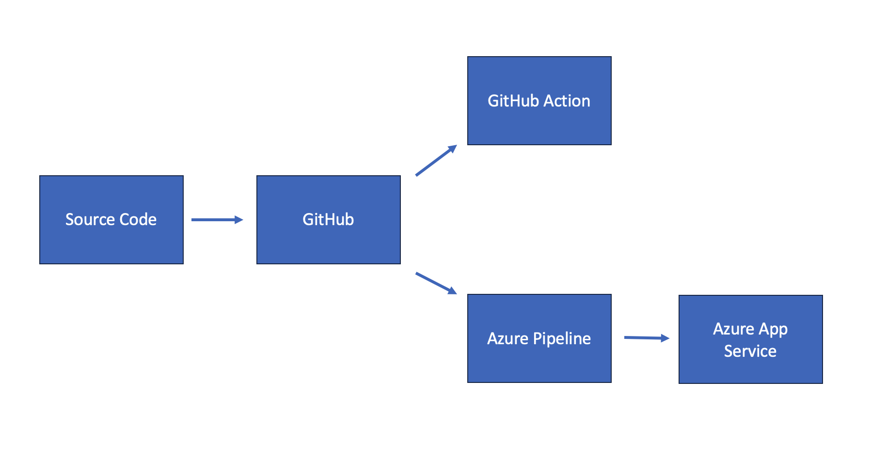

The source code gets pushed to GitHub. This triggers the GitHub Action for testing and the Azure Pipeline for building the application and deploying to Azure App Service.

In order to run the project, perform the following steps:

### Run the app in Azure Cloud Shell
1. Open an Azure cloud shell.

2. Generate an SSH key by using
```bash
ssh-keygen -t rsa
```

3. Read out the key by using
```bash
cat ~/.ssh/id_rsa.pub
```
and add it to your GitHub account.

4. Clone the project using
```bash
git clone git@github.com:t85/CloudDevops-Building-A-CI-CD-Pipeline.git
```
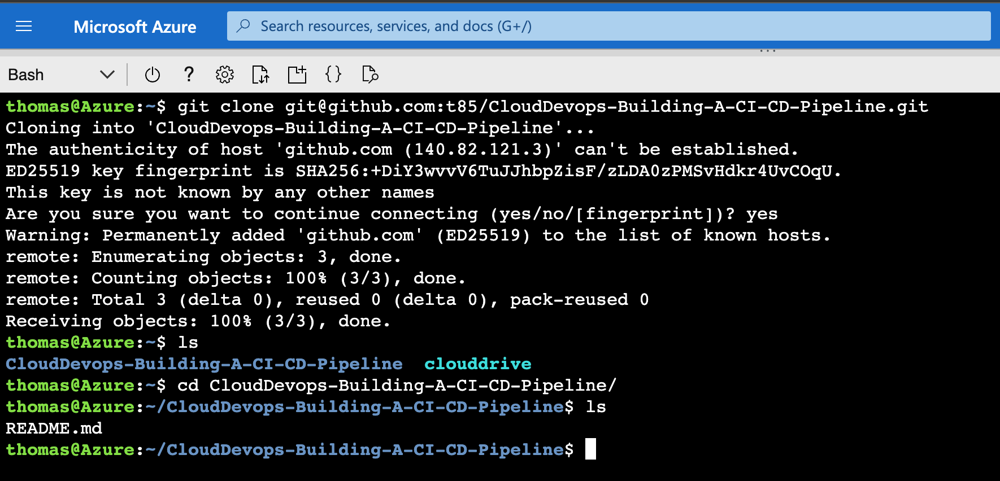

5. Create a new Python environment:
```bash
python3 -m venv ~/.flask-ml-azure
source ~/.flask-ml-azure/bin/activate
```

6. Install dependencies and run tests:
```bash
make install
```
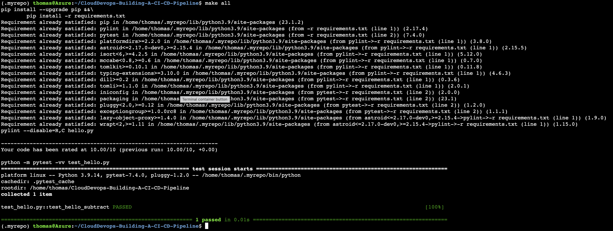

7. Make a prediction:
```bash
./make_prediction.sh
```
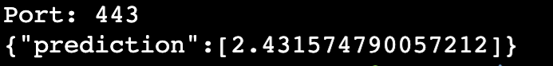


8. Also, the GitHub action was successful:

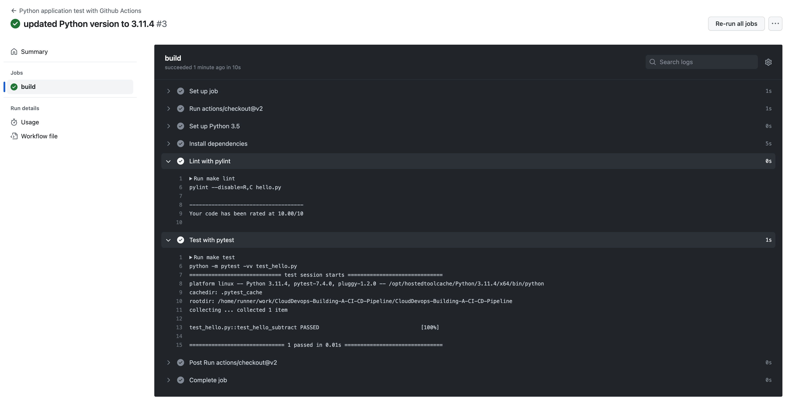

9. You can deploy the application in the Azure Cloud Shell to Azure App Service by using
```bash
az webapp up --resource-group Azuredevops 
             --name flask-ml-service-thomas 
             --sku F1
            --location eastus 
            --verbose
```

10. Now you can run the project again:

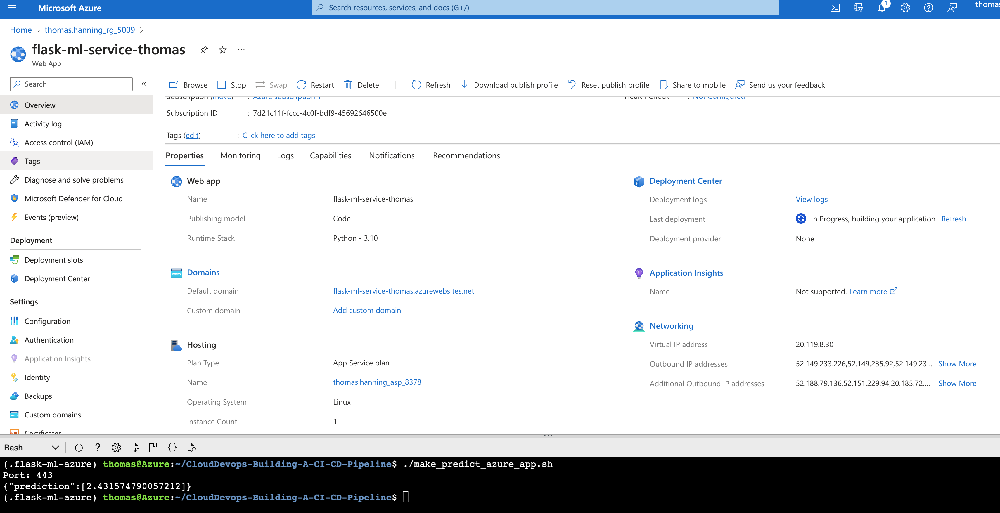


### Deploy the app using CI/CD

In order to trigger the CI/CD process, commit and push the repository.

Then, the azure pipeline will build the project:

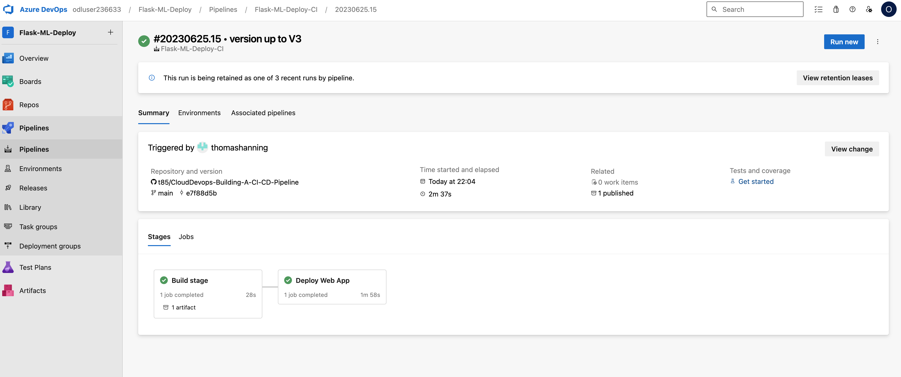

Take a look at the documention for more information about this topic: https://docs.microsoft.com/en-us/azure/devops/pipelines/ecosystems/python-webapp?view=azure-devops.

And also the GitHub Action was successfull:

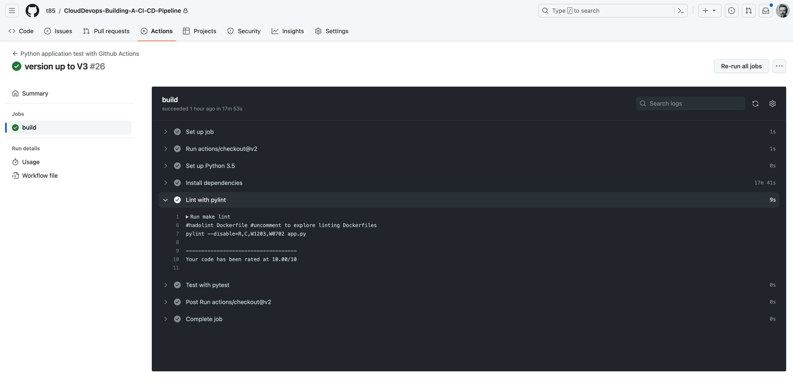

Let's make another prediction from the deployed project:

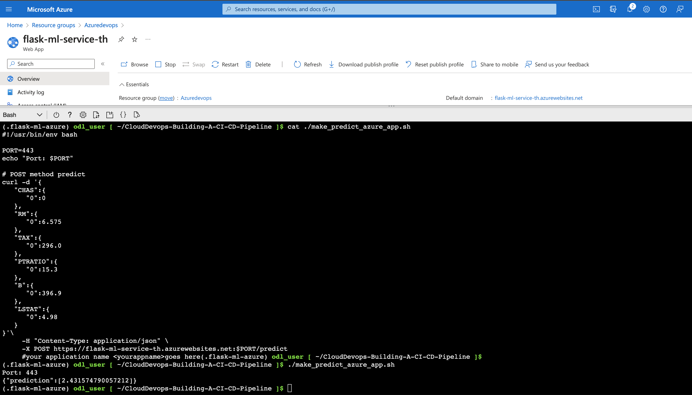

In order to observe the application, you can take a look at the logs by using

```bash
az webapp log tail -g flask-ml-service-th --name flask-ml-service-th
```

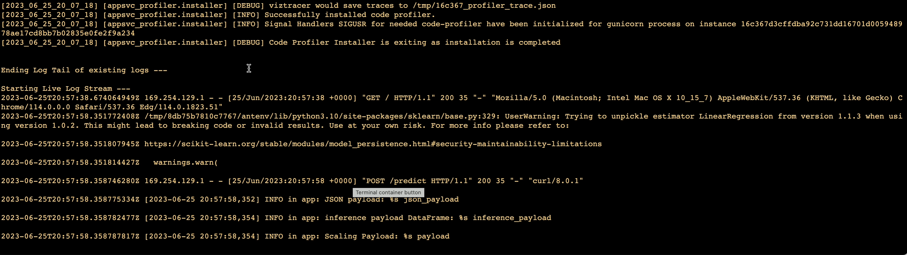

### Load testing

You can use Locust to perform a load test. For that, install Locust by using

```bash
pip install locust
locust
```

Now you can use locus on your browser using localhost:
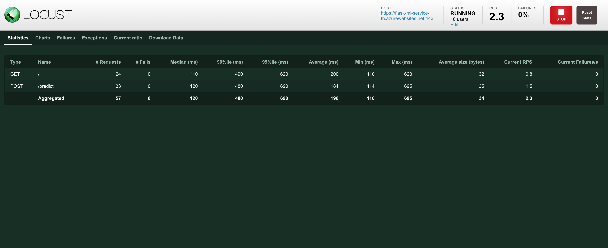


## Enhancements

For a real project you would work with several branches for a better development process. For examlple, you could use GitFlow: master, development and release branches.
Also, different stages would be neccessary: At least one production stage and one integration/develpment stage.

## Demo 

You can see a demo on the following Youtube screencast:
https://www.youtube.com/watch?v=0GBhjHneWek
